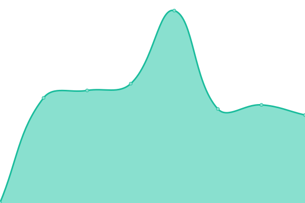

# [📈 Live Status](https://status.smirkhat.org): <!--live status--> **🟩 All systems operational**

This repository contains the open-source uptime monitor and status page for [SmirkHat](https://smirkhat.org), powered by [Upptime](https://github.com/upptime/upptime).

With [Upptime](https://upptime.js.org), you can get your own unlimited and free uptime monitor and status page, powered entirely by a GitHub repository. We use [Issues](https://github.com/SmirkHat/smirkhat-upptime/issues) as incident reports, [Actions](https://github.com/SmirkHat/smirkhat-upptime/actions) as uptime monitors, and [Pages](https://status.smirkhat.org) for the status page.

<!--start: status pages-->
<!-- This summary is generated by Upptime (https://github.com/upptime/upptime) -->
<!-- Do not edit this manually, your changes will be overwritten -->
<!-- prettier-ignore -->
| URL | Status | History | Response Time | Uptime |
| --- | ------ | ------- | ------------- | ------ |
|  [Hlavní blog](https://smirkhat.org) | 🟩 Up | [hlavni-blog.yml](https://github.com/SmirkHat/smirkhat-upptime/commits/HEAD/history/hlavni-blog.yml) | 

 785ms
     
 | 

<a href="https://status.smirkhat.org/history/hlavni-blog">99.69%</a>
    

|  [Počasí aplikace](http://web-m8b6oqk.hstnw.eu/) | 🟩 Up | [pocasi-aplikace.yml](https://github.com/SmirkHat/smirkhat-upptime/commits/HEAD/history/pocasi-aplikace.yml) | 

 469ms
     
 | 

<a href="https://status.smirkhat.org/history/pocasi-aplikace">100.00%</a>
    

|  [Backend pro blog](https://pb.smirkhat.org/_/) | 🟩 Up | [backend-pro-blog.yml](https://github.com/SmirkHat/smirkhat-upptime/commits/HEAD/history/backend-pro-blog.yml) | 

 518ms
     
 | 

<a href="https://status.smirkhat.org/history/backend-pro-blog">100.00%</a>
    

<!--end: status pages-->

[**Visit our status website →**](https://status.smirkhat.org)

## 📄 License

- Powered by: [Upptime](https://github.com/upptime/upptime)
- Code: [MIT](./LICENSE) © [Anand Chowdhary](https://anandchowdhary.com), supported by [Pabio](https://pabio.com)
- Data in the `./history` directory: [Open Database License](https://opendatacommons.org/licenses/odbl/1-0/)
